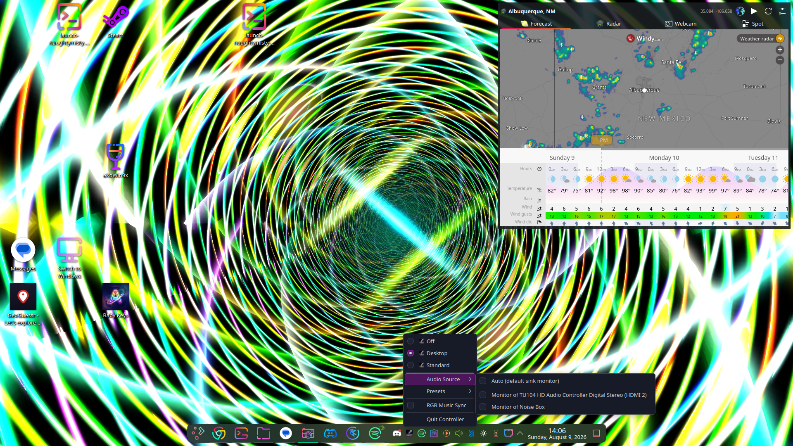
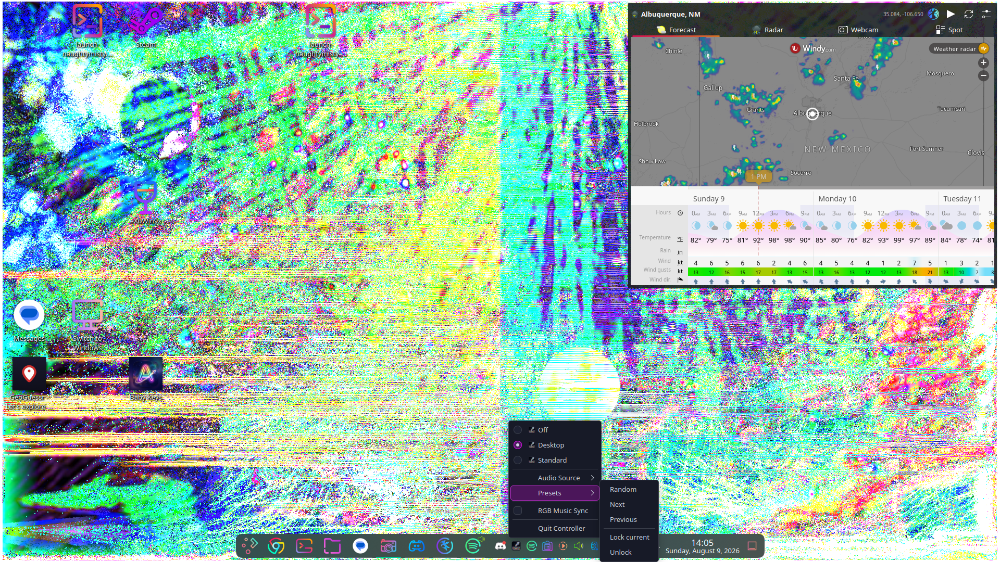
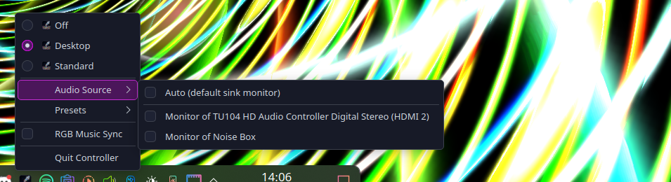
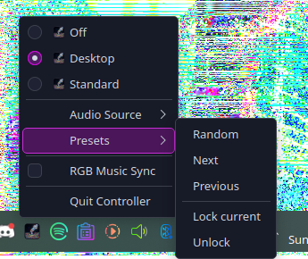
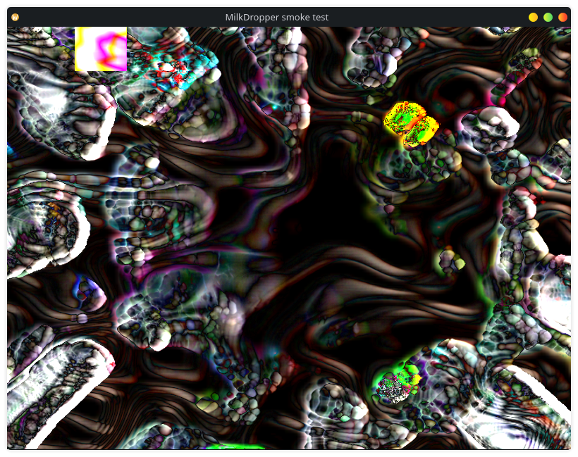
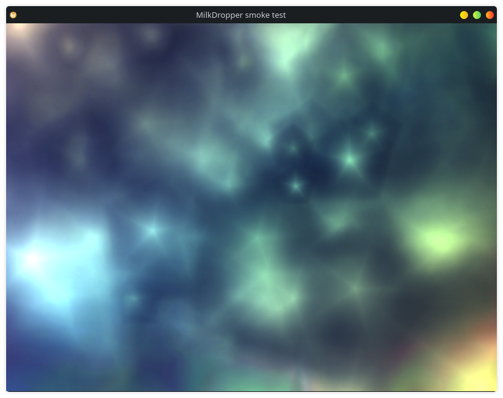

<h1 align="center">
  <br>
  
  <br>
  MilkDropper
  <br>
  <sub><em>a KDE Plasma controller for <a href="https://github.com/projectM-visualizer/projectm">projectM</a> — the open-source MilkDrop visualizer</em></sub>
  <br>
</h1>

<p align="center">
  <a href="https://github.com/projectM-visualizer/projectm"></a>
  <a href="https://github.com/sworrl/MilkDropper/releases"></a>
</p>

<p align="center">
  <a href="https://kde.org/plasma-desktop/"></a>
  <a href="https://qt.io"></a>
  <a href="https://python.org"></a>
  <a href="https://pipewire.org"></a>
  <a href="LICENSE"></a>
  <a href="https://github.com/projectM-visualizer/projectm/blob/master/LICENSE.txt"></a>
  <a href="https://kernel.org"></a>
</p>

> Music visualization the way it was meant to be: full-screen, beat-synced, hypnotic, and running on *your* desktop — behind your icons, under your windows, reacting to whatever you're playing. The way Winamp did it in 2001, except now it's your wallpaper.

> **Heads up: naming & credit.** **MilkDropper** is the name of *this tool* — a system-tray controller and Plasma wallpaper renderer. **[projectM](https://github.com/projectM-visualizer/projectm)** is the *visualization engine* that does every last pixel of the actual rendering — it is the projectM team's work, not ours, and this project would be a tray icon pointing at a black rectangle without them. **MilkDrop** is Ryan Geiss's original Winamp plugin that started it all. The names are intentionally distinct so credit lands where it belongs. See [Standing on the shoulders of giants](#standing-on-the-shoulders-of-giants).

---

## Table of contents

- [What it does](#what-it-does)
- [Screenshots](#screenshots)
- [Standing on the shoulders of giants](#standing-on-the-shoulders-of-giants)
- [Requirements](#requirements)
- [Two things that will bite you](#two-things-that-will-bite-you)
- [Installation](#installation)
- [Configuration](#configuration)
- [Usage](#usage)
- [How it works](#how-it-works)
- [Building packages](#building-packages)
- [Troubleshooting](#troubleshooting)
- [FAQ](#faq)
- [Platform support](#platform-support)
- [Contributing](#contributing)
- [License & attribution](#license--attribution)

---

## What it does

MilkDropper sits in your system tray and manages three modes of the projectM visualizer:

| Mode | What happens |
|---|---|
| **Desktop** | projectM renders as your live Plasma wallpaper — behind icons, above nothing. One renderer per screen, every monitor reactive. |
| **Standard** | projectMSDL runs as a regular window you can place anywhere |
| **Off** | Normal desktop, visualizer killed |

- **Left-click** the tray icon → instant random preset
- **Right-click** → mode menu, per-source **audio routing** (PipeWire/PulseAudio), **preset controls** (next / previous / random / lock), and optional **OpenRGB music sync** that drives your RGB hardware from the same audio
- **Single-instance** — launching MilkDropper again doesn't spawn a second tray icon; it just opens the running instance's menu
- **Multi-monitor** — commands reach the renderer on *every* screen, not just one
- The wallpaper renderer is **native C++** (a `QQuickFramebufferObject` driving the [projectM 4 C API](https://github.com/projectM-visualizer/projectm)), audio-fed from a lock-free ring buffer, vsync-locked to your compositor

---

## Screenshots

<div align="center">

**Desktop mode** — projectM as the live wallpaper, behind icons and under windows, with the tray menu open:





**The tray menus** — mode switching, per-device audio routing, and preset controls:

| Audio routing | Preset controls |
|---|---|
|  |  |

**The renderer up close:**

| Windowed | GLES pipeline |
|---|---|
|  |  |

*Every visual in these screenshots was drawn by [projectM](https://github.com/projectM-visualizer/projectm). MilkDropper's contribution is the desktop it's drawn on.*

</div>

---

## Standing on the shoulders of giants

MilkDropper is a **thin controller around other people's brilliance**. Read this section before you star this repo — and then go star theirs.

### projectM — the engine

**[projectM](https://github.com/projectM-visualizer/projectm)** is the open-source, cross-platform reimplementation of MilkDrop, maintained by the [projectM team](https://github.com/projectM-visualizer) and distributed under the [LGPL-2.1-or-later](https://github.com/projectM-visualizer/projectm/blob/master/LICENSE.txt). It parses MilkDrop's `.milk` preset language — per-frame and per-vertex equations, warp and composite shaders, custom waves and shapes — compiles it, evaluates it in real time against a live audio FFT, and renders the result in OpenGL. It has been doing this since the mid-2000s, across more platforms than most projects ever target, and version 4 rewrote the core into a clean C API with a separate playlist library.

Every visual you will ever see through MilkDropper is projectM's work:

| projectM does | MilkDropper adds |
|---|---|
| Preset parsing, compilation & evaluation | A tray icon |
| Beat detection & audio analysis | Getting PipeWire audio *to* the engine |
| All rendering — warps, shaders, waves, transitions | A Qt Quick surface for the engine to render *into* |
| MilkDrop compatibility, two decades of it | Plasma wallpaper & KWin integration around it |
| The playlist engine (shuffle, history, retry) | Menu items that call it |

- **Engine:** [github.com/projectM-visualizer/projectm](https://github.com/projectM-visualizer/projectm)
- **Preset & texture packs:** [presets-cream-of-the-crop](https://github.com/projectM-visualizer/presets-cream-of-the-crop) · [presets-milkdrop-texture-pack](https://github.com/projectM-visualizer/presets-milkdrop-texture-pack) · [presets-milkdrop-original](https://github.com/projectM-visualizer/presets-milkdrop-original)
- **Their frontends:** projectMSDL (used by MilkDropper's Standard mode, also [on Steam](https://store.steampowered.com/app/1358800/projectM_Music_Visualizer/)), plus Android and more

If MilkDropper is useful to you, **the engine is where the magic is**: [star it](https://github.com/projectM-visualizer/projectm), report engine bugs there, and send them your presets.

### MilkDrop — the origin

**[MilkDrop](http://www.geisswerks.com/milkdrop/)** is Ryan Geiss's music visualization plugin for Winamp (Nullsoft), first released in 2001. MilkDrop 2 added pixel shaders and its preset format became a *lingua franca* — thousands of preset authors wrote hundreds of thousands of `.milk` files, an entire generative-art scene flourishing inside a media player plugin. Geiss later released the MilkDrop 2 source under a BSD-style license, which is part of why faithful reimplementations like projectM exist at all.

### The preset authors

Presets are *programs*, and the ones you'll watch were written by a community of artists across two decades — names like Flexi, Geiss, Rovastar, Krash, martin, Aderrasi, Eo.S., Zylot, shifter, cope, stahlregen and hundreds more live in the preset filenames themselves. When a visual blows your mind, the filename tells you who to thank. MilkDropper ships no presets; the packs above carry the authors' work and credits.

### Sister project: PipeDreams

**[PipeDreams](https://github.com/sworrl/pipedreams)** is MilkDropper's sister
project — a PyQt6 audio control center for PipeWire: real-time spectrum
analysis, a 10-band parametric EQ, device routing, and its own arsenal of
visualization modes. The two are **independent** (install either alone) but
**fully interoperable**: PipeDreams' MilkDropper tab remote-controls the
wallpaper (presets, lock, launch) and hands its selected capture device to the
renderer, and MilkDropper's tray gains an "Open PipeDreams" entry when it's
installed. The contract they share is one page:
[`docs/INTEROP.md`](docs/INTEROP.md) — two files in `/tmp` and a local socket,
no imports, no coupling.

### Not affiliated

MilkDropper is an **independent, unofficial** project. It is not affiliated with, maintained by, or endorsed by the projectM team, Ryan Geiss, Nullsoft, or Winamp. Please **do not report MilkDropper bugs to the projectM project** — anything broken here is on us until proven otherwise.

---

## Requirements

- **KDE Plasma 6** on Wayland or X11
- **Qt 6.5+** (`qt6-base-dev`, `qt6-declarative-dev` to build)
- **libprojectM 4** built with `ENABLE_GLES` — the packages below handle this
- **Python 3.11+** with `PyQt6`
- **PipeWire** or **PulseAudio** for audio capture
- **projectMSDL** for Standard mode — [Steam](https://store.steampowered.com/app/1358800/projectM_Music_Visualizer/) (App ID `1358800`) or built from source
- A working brain and a Linux installation

---

## Two things that will bite you

**1. Desktop mode needs Plasma's Qt Quick scene graph on OpenGL.**
The wallpaper renderer is a `QQuickFramebufferObject`, which is OpenGL-only. If
Plasma runs its scene graph on Vulkan, the wallpaper renders *nothing*, silently.
(MilkDropper warns you with a notification if you enable Desktop mode on the
wrong backend.)

```bash
# check
kreadconfig6 --file kdeglobals --group QtQuickRendererSettings --key SceneGraphBackend
# fix
kwriteconfig6 --file kdeglobals --group QtQuickRendererSettings --key SceneGraphBackend opengl
systemctl --user restart plasma-plasmashell.service
```

This is session-wide — every KDE Qt Quick app switches with it. And note that
`QSG_RHI_BACKEND` does **not** work here: KDE's platform theme calls
`QQuickWindow::setGraphicsApi()`, which overrides the environment variable.

**2. libprojectM must be a GLES build.**
Qt Quick hands out OpenGL **ES** contexts on Wayland, and a desktop-GL
libprojectM refuses to initialise on those — `projectm_create()` just returns
NULL. MilkDropper links a libprojectM built with `ENABLE_GLES`, installed in the
private prefix `/usr/lib/milkdropper` so it cannot shadow a system libprojectM
carrying the same SONAME. The QML plugin finds it via RPATH.

Standard mode is unaffected by both of these and works anywhere.

---

## Installation

### Debian / Ubuntu / KDE neon

Grab the `.deb`s from [Releases](https://github.com/sworrl/MilkDropper/releases):

```bash
# with the library package:
sudo dpkg -i libprojectm4-gles_*.deb milkdropper_*.deb

# or fully self-contained (bundles the GLES libprojectM):
sudo dpkg -i milkdropper-standalone_*.deb

sudo apt -f install   # pull in any missing dependencies
```

### Fedora / RPM

The release ships a source RPM; rebuild it on your machine so it links your
distribution's Qt:

```bash
sudo dnf install rpm-build cmake gcc-c++ libglvnd-devel \
                 qt6-qtbase-devel qt6-qtdeclarative-devel pulseaudio-libs-devel
rpmbuild --rebuild milkdropper-*.src.rpm
sudo dnf install ~/rpmbuild/RPMS/x86_64/milkdropper-*.rpm
```

The binary RPM in the release was built on Ubuntu against Qt 6.11 — it works if
your distro's Qt is ≥ 6.11, otherwise rebuild from the SRPM (takes a couple of
minutes; the SRPM bundles the projectM source, no network needed).

### From source

```bash
sudo apt install cmake pkg-config qt6-base-dev qt6-declarative-dev \
                 libpulse-dev python3-pyqt6

git clone https://github.com/sworrl/MilkDropper.git
cd MilkDropper
./install.sh                     # /usr/local, uses sudo
```

`PREFIX=~/.local ./install.sh` does a user install instead (sudo is still needed
for the one QML module that must live in Qt's import path — plasmashell searches
nowhere else; override with `QML_INSTALL_DIR=`).

`install.sh` expects the GLES libprojectM at `/usr/lib/milkdropper` and prints
the exact build commands if it's missing. The Debian packaging for the library
lives in [`packaging/libprojectm4-gles/`](packaging/libprojectm4-gles/).

### Windows

No. Read the [Platform support](#platform-support) section.

---

## Configuration

Presets, textures and the projectMSDL binary are discovered at runtime, in order:

1. `$MILKDROPPER_PRESET_PATH`, `$MILKDROPPER_TEXTURE_PATH`, `$MILKDROPPER_PROJECTMSDL`
2. `~/.config/milkdropper/milkdropper.conf`
3. Well-known locations, including the Steam build of projectM

```ini
# ~/.config/milkdropper/milkdropper.conf
[Paths]
Presets=/path/to/presets
Textures=/path/to/textures
ProjectMSDL=/path/to/projectMSDL
```

Check what was found:

```bash
python3 /usr/share/milkdropper/milkdropper_paths.py     # /usr/local/share for source installs
```

No presets yet? Get the community's finest — these are the projectM team's
curated collections of the MilkDrop community's work:

- [Cream of the Crop](https://github.com/projectM-visualizer/presets-cream-of-the-crop) — ~10k hand-picked presets
- [Original MilkDrop presets](https://github.com/projectM-visualizer/presets-milkdrop-original) — the classics that shipped with Winamp
- [Texture pack](https://github.com/projectM-visualizer/presets-milkdrop-texture-pack) — many presets sample these
- Any Winamp/MilkDrop `.milk` collection you've hoarded since 2004 works too

---

## Usage

Launch from the application launcher (search **MilkDropper**) or run `milkdropper`.
Launching again while it's running just opens the tray menu — there is never a second instance.

**Tray controls:**

| Action | Result |
|---|---|
| Left-click icon | Random preset |
| Right-click icon | Mode menu |
| Mode → Desktop | projectM as wallpaper |
| Mode → Standard | projectMSDL window |
| Mode → Off | Kill visualizer |
| Audio Source submenu | Route audio per-source |
| Presets → Next/Prev/Random | Navigate presets |
| Presets → Lock/Unlock | Hold current preset |
| RGB Music Sync | Drive OpenRGB devices from the audio (needs `openrgb` + `python3-openrgb`) |

**Keyboard**, when the Desktop-mode wallpaper has focus (click it first):

| Key | Action |
|---|---|
| `n` / `→` / `↓` | Next preset |
| `p` / `←` / `↑` | Previous preset |
| `r` / space | Random preset |
| `l` | Toggle preset lock |

**Audio routing:** MilkDropper captures system audio via PipeWire/PulseAudio.
Pick a `*.monitor` source in the tray to visualize whatever is playing. On
startup it auto-selects the monitor of whichever sink is actually RUNNING.
The choice persists and applies immediately, no restart.

---

## How it works

```
MilkDropper/
├── controller/
│   ├── tray-controller.py        # PyQt6 system tray — the main entry point (single-instance)
│   ├── milkdropper_paths.py      # Shared preset/texture/binary discovery
│   ├── launch-wallpaper.sh       # Launcher (installed as bin/milkdropper)
│   ├── rgb-music.py              # OpenRGB audio sync (spawns audio-fft.py)
│   ├── audio-fft.py              # PipeWire capture → FFT bands over local HTTP
│   ├── cycle-mode.sh             # Hotkey-friendly mode cycler (X11 only)
│   ├── set-mode.sh               # Raw mode setter (xprop — X11 only)
│   └── projectm_intercept.c      # LD_PRELOAD shim — intercepts SDL quit events
├── plasma-wallpaper/             # Plasma wallpaper package (QML)
│   └── contents/ui/main.qml      # Instantiates the renderer, forwards keys
├── kwin-script/                  # KWin script — pushes projectMSDL behind the desktop
├── qml-plugin/                   # C++ Qt Quick module (org.projectm.renderer)
│   ├── projectmitem.h/cpp        # QQuickFramebufferObject driving the projectM 4 C API
│   └── CMakeLists.txt            # qt_add_qml_module; RPATHs the private GLES libprojectM
├── packaging/
│   ├── rpm/milkdropper.spec      # Self-contained RPM (bundles GLES libprojectM)
│   └── libprojectm4-gles/        # Debian packaging for the library
├── debian/                       # Debian packaging (milkdropper + -standalone)
└── icons/scalable/               # Full SVG icon set (colored + symbolic)
```

**Desktop mode, end to end:**

```
tray menu → wallpaperPlugin = org.projectm.wallpaper
         → plasmashell loads plasma-wallpaper/main.qml on every screen
         → each instantiates a ProjectMItem (org.projectm.renderer QML module)
         → projectm_create_with_opengl_load_proc(Qt's GL resolver)   ← projectM 4 C API
         → projectm_playlist_add_path(discovered preset dir)
         → AudioCapture thread: pa_simple_read on the chosen monitor source
             → lock-free ring buffer → drained in synchronize()
             → projectm_pcm_add_float(..., PROJECTM_STEREO) per frame
         → projectm_opengl_render_frame_fbo(item's FBO) at compositor vsync
```

Design notes, learned the hard way:

- **Rendering is driven from `QQuickWindow::afterAnimating`** (GUI thread, once
  per frame): marking the item dirty there self-sustains the loop and throttles
  to the compositor. Do not "optimize" it back to `afterRendering` — that runs
  on the render thread, where `update()` is rejected and the loop stalls after
  exactly one frame.
- **GL function resolution goes through Qt** (`projectm_create_with_opengl_load_proc`),
  because projectM's built-in resolver assumes GLX and Qt on Wayland is EGL.
- **The tray talks to renderers through `/tmp/projectm-cmd`**, mtime-deduplicated
  *per renderer instance* and never deleted — deleting it was a bug that let
  whichever screen polled first starve the others.
- **Single-instance** is a `QLocalServer` socket (`milkdropper-tray`); a second
  launch connects, the running instance pops its menu, the new process exits.
  Stale sockets from crashes are cleaned on startup.
- **projectM 4 vs 3:** the 3.x C++ API (`projectM::Settings`, `key_handler`,
  `pcm()->addPCMfloat_2ch`) is gone in 4.x. Preset navigation moved into the
  separate `projectM-4-playlist` library; PCM counts are *frames per channel*,
  not floats — get that wrong and your beat detection runs at double speed.

---

## Building packages

```bash
# Debian packages (milkdropper + milkdropper-standalone)
dpkg-buildpackage -us -uc -b

# RPM — from the release SRPM
rpmbuild --rebuild milkdropper-*.src.rpm

# RPM — from a checkout (see packaging/rpm/milkdropper.spec header for tarball prep)
rpmbuild -bs packaging/rpm/milkdropper.spec
```

`debian/rules` drives `install.sh` for its staging, so the deb layout and a
from-source install cannot drift apart. The RPM spec bundles the projectM
source and builds the GLES library into the private prefix as part of the same
package (RPM equivalent of `milkdropper-standalone`), declaring
`Provides: bundled(libprojectM)` like an honest package should.

---

## Troubleshooting

**Visualizer doesn't appear in Desktop mode (black wallpaper)**
- Almost always the scene graph backend. See [Two things that will bite you](#two-things-that-will-bite-you).
- Confirm the QML module is installed: `ls $(qmake6 -query QT_INSTALL_QML)/org/projectm/renderer/`
- Watch it start: `journalctl --user -f | grep ProjectM` while switching modes.
  A healthy start logs the GL context, `projectM 4.x.y instance created`, and a preset count.

**`projectm_create() failed — OpenGL context insufficient?`**
- Your libprojectM is a desktop-GL build but Qt handed out a GLES context. Use
  the packaged library, or rebuild yours with `-DENABLE_GLES=ON`.

**No audio reactivity**
- Tray → Audio Source → pick a `*.monitor` source.
- `pactl info | grep Server` — is PipeWire/PulseAudio actually up?
- `journalctl --user -f | grep AudioCapture` — you should see `stream open, capturing`.

**Preset changes only affect one monitor**
- Fixed in 1.1.0 — update.

**projectMSDL exits immediately (Standard mode)**
- Build the LD_PRELOAD shim: `gcc -shared -fPIC -o projectm_intercept.so controller/projectm_intercept.c -ldl`

**RGB sync does nothing**
- It needs `openrgb` (running or in PATH) and `python3-openrgb`. The FFT server
  (`audio-fft.py`) is spawned automatically and needs `python3-numpy` and `parec`.

---

## FAQ

**Why is the wallpaper black after install?**
Plasma's scene graph is on Vulkan. [Fix](#two-things-that-will-bite-you). MilkDropper
also sends you a notification about exactly this when you switch to Desktop mode.

**Can I use my old Winamp presets?**
Yes — that's the entire point. projectM parses MilkDrop's `.milk` format,
including most MilkDrop 2 shader presets. Point `Presets=` at your collection.

**Does this work on GNOME / Sway / Hyprland?**
Desktop mode is Plasma-only (it *is* a Plasma wallpaper plugin). Standard mode
is just projectMSDL and runs anywhere — but then you don't need MilkDropper,
you need [projectM](https://github.com/projectM-visualizer/projectm).

**Why do you bundle your own libprojectM?**
Because the one your distro ships (if any) is a desktop-GL build, and Qt Quick
on Wayland hands out GLES contexts. Ours is built with `ENABLE_GLES` and hidden
in `/usr/lib/milkdropper` where it can't fight your system copy. Details in
[Two things that will bite you](#two-things-that-will-bite-you).

**How heavy is it?**
The renderer is vsync-locked, so one preset costs roughly what a game menu
costs. Preset complexity varies wildly — some `.milk` files are shader
monsters. The tray itself is an idle PyQt process.

**Where do preset changes go when I click "Next"?**
`/tmp/projectm-cmd` → polled at 10 Hz by every screen's renderer →
`projectm_playlist_play_next()`. Yes, it's a file. It works, it's
introspectable, and you can drive it from scripts: `echo random > /tmp/projectm-cmd`.

**Windows?**
[No.](#platform-support)

---

## Platform support

> **Linux only. That's it. That's the list.**
>
> This project uses KDE Plasma wallpaper APIs, KWin scripting, xprop, xdotool, PipeWire, and DBus — none of which exist on Windows, and none of which we intend to abstract away.
>
> If you're on Windows and want reactive music visualizers: good news, Winamp still exists and [MilkDrop 2](http://www.geisswerks.com/milkdrop/) runs natively. You're welcome.
>
> If you're on Windows and want to use *this specifically*: **git gud**, install Linux, and come back when you're ready.

macOS *might* work with significant effort. PRs welcome, but don't hold your breath.

---

## Contributing

PRs welcome for: new features, preset integrations, packaging improvements, Wayland fixes.

Engine work belongs upstream — if you can make projectM itself better, [they take PRs too](https://github.com/projectM-visualizer/projectm), and improvements there benefit every frontend, not just this one.

Please don't open issues asking for Windows support. The answer is no. The answer will always be no.

---

## License & attribution

- **MilkDropper** (this repository): [MIT](LICENSE) — do whatever you want, just don't remove the attribution.
- **projectM** (the bundled/linked engine): [LGPL-2.1-or-later](https://github.com/projectM-visualizer/projectm/blob/master/LICENSE.txt), © 2003–present the projectM team. The packages ship an unmodified build of libprojectM 4; source for exactly what's bundled is in the release SRPM and at the [projectM repository](https://github.com/projectM-visualizer/projectm).
- **MilkDrop** design & preset language: Ryan Geiss / Nullsoft; MilkDrop 2 source was released under a BSD-style license.
- **Presets** are the copyrighted work of their individual authors, distributed in the projectM team's preset packs with credits in the filenames.

---

<div align="center">

**MilkDropper** is plumbing. **[projectM](https://github.com/projectM-visualizer/projectm)** is the art engine. **[MilkDrop](http://www.geisswerks.com/milkdrop/)** is the reason any of this exists.

*Built for KDE Plasma. Powered by projectM. Inspired by the MilkDrop era of desktop personalization.*

⭐ [Star projectM](https://github.com/projectM-visualizer/projectm) · ⬇️ [MilkDropper releases](https://github.com/sworrl/MilkDropper/releases)

</div>
